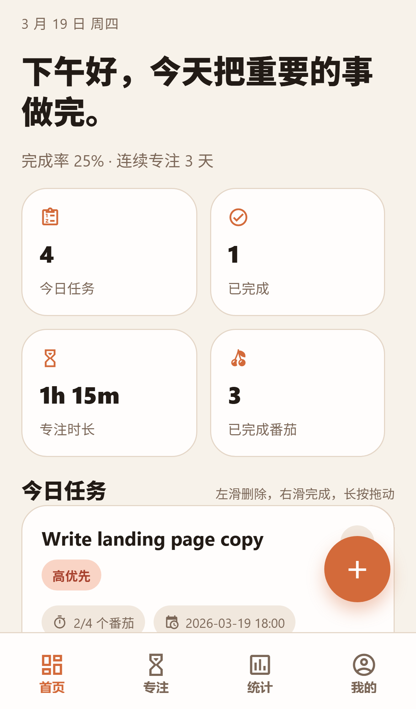
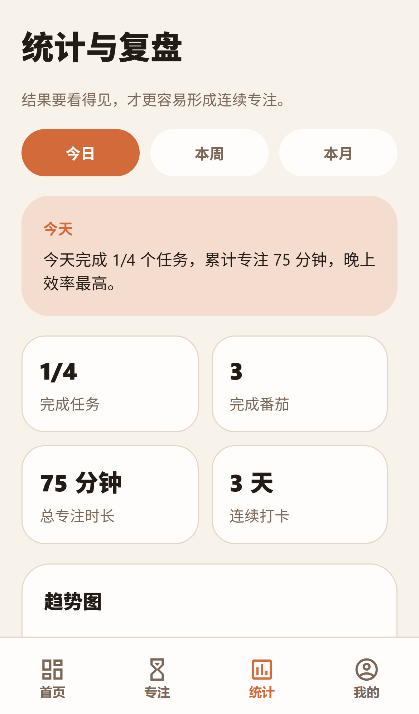
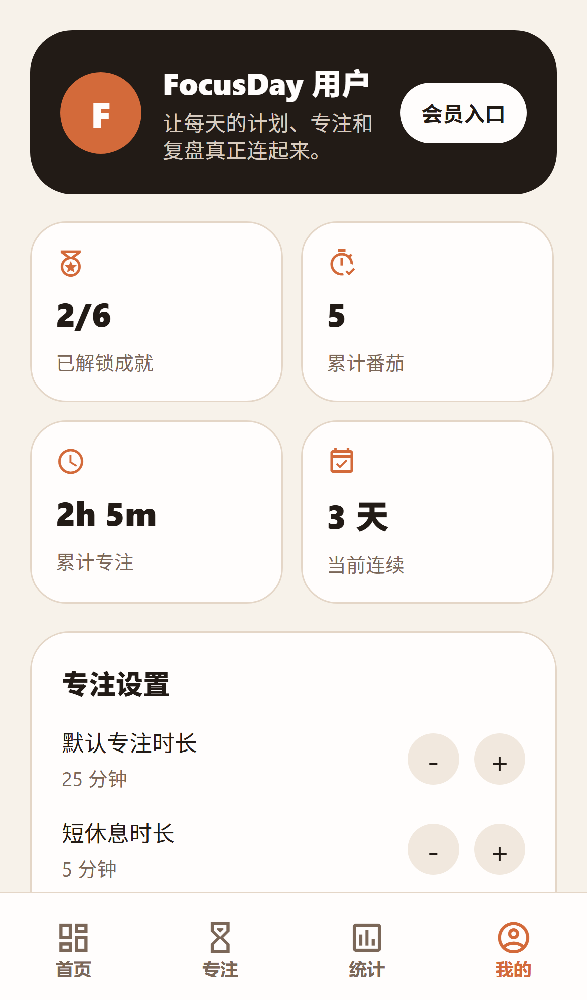

# FocusDay

[English README](./README.md)

FocusDay 是一个基于 Expo 和 React Native 开发的本地优先番茄工作法应用。
它把每日任务规划、任务绑定专注、数据复盘、成就系统和日期范围任务整合在同一个移动端体验中。

## 应用截图

<p align="center">
  
  
  
  
</p>

## 主要特性

- 以任务为中心的番茄工作流，而不是单独的计时器
- 支持优先级、备注、截止时间、拖拽排序和快速开始专注的今日任务看板
- 支持按日期范围创建任务，避免每天重复手动添加
- 系列任务支持 `仅当前`、`本次以后`、`全部` 三种编辑和删除范围
- 支持专注、短休息、长休息三个阶段，并可自定义时长
- 支持专注结束本地通知，息屏状态下也能收到提醒
- 支持日、周、月维度统计
- 支持成就解锁、进度展示和弹层提醒
- 基于 AsyncStorage 的本地优先数据存储

## 产品范围

FocusDay 当前围绕一个核心闭环设计：

1. 规划今天要做的事
2. 选择具体任务开始专注
3. 完成番茄并累计任务进度
4. 查看今日产出和连续专注状态

当前仓库面向 MVP 阶段：

- 单用户使用
- 仅本地存储
- 暂无云同步
- 暂无社交和团队协作

## 技术栈

- Expo
- React Native
- Expo Router
- TypeScript
- AsyncStorage
- Expo Notifications
- React Native Gesture Handler
- React Native Draggable FlatList

## 目录结构

```text
app/           Expo Router 页面
components/    共享组件
constants/     主题和常量
context/       全局状态和业务逻辑
types/         TypeScript 类型定义
utils/         日期、统计、成就、通知工具
scripts/       README 辅助脚本
assets/        图标、截图和静态资源
```

## 本地运行

### 环境要求

- Node.js 20+
- npm
- 通过 `npx` 使用 Expo CLI

### 安装依赖

```bash
npm install
```

### 开发运行

```bash
npm start
```

也可以直接运行指定平台：

```bash
npm run android
npm run ios
npm run web
```

## 打包 APK

项目已经配置好 EAS Android 预览构建：

```bash
npm run build:apk
```

首次打包前需要登录 Expo EAS：

```bash
npx eas-cli login
```

## 核心功能

### 任务管理

- 新增、编辑、删除、排序、完成、恢复任务
- 配置优先级、备注、截止时间和预估番茄数
- 按日期范围批量创建任务
- 对系列任务按范围进行更新

### 专注流程

- 专注必须绑定具体任务
- 支持专注、短休息、长休息切换
- 支持暂停、继续、跳过休息和提前结束
- 每次完整专注结束后显示完成弹层
- 到点触发本地通知提醒

### 数据与激励

- 今日、本周、本月统计
- 专注时长与番茄数量统计
- 成就系统与解锁提示
- 基于完成专注日的连续打卡计算

## 当前限制

- 数据只保存在本地设备
- 没有账号系统和多端同步
- 没有协作、社交和排行榜
- 没有接入后端服务或远程分析

## 规划方向

- 云备份和多设备同步
- 更完整的重复任务规则
- 更丰富的通知交互
- 更细的成就等级和历史记录
- 团队或共享专注模式

## 参与贡献

欢迎提交 Issue 和 Pull Request。较大改动建议先开 Issue，先把问题范围讲清楚。

## 当前状态

持续迭代中的 MVP 版本。
